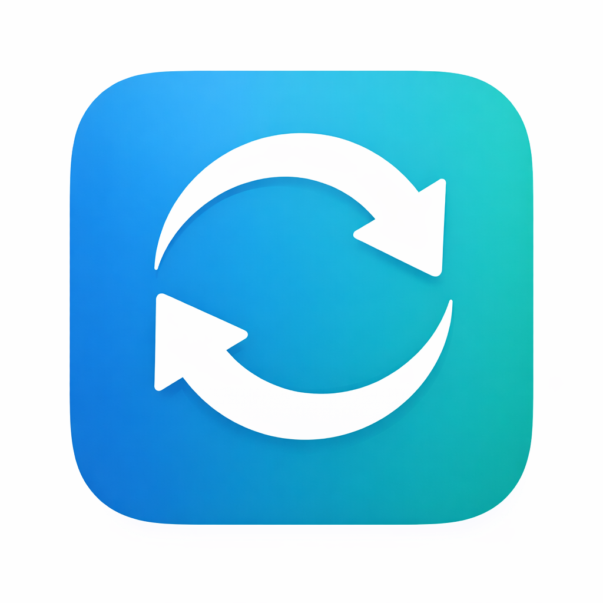
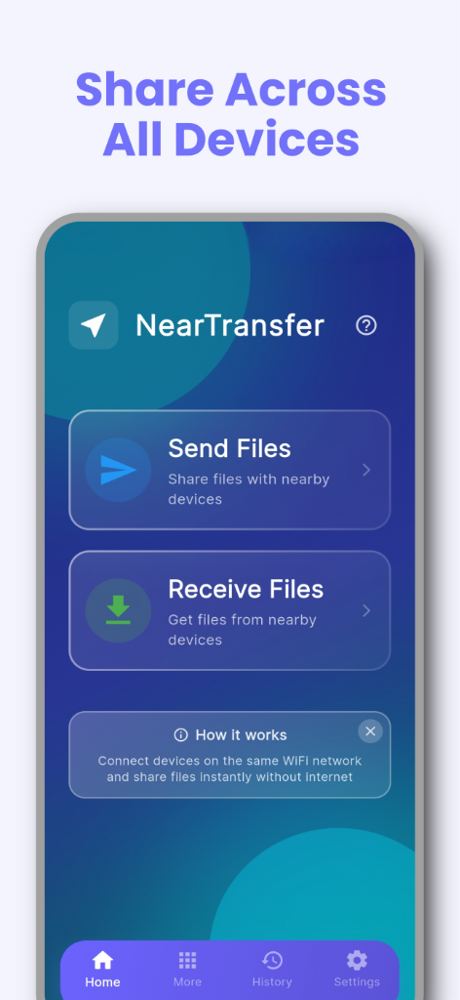
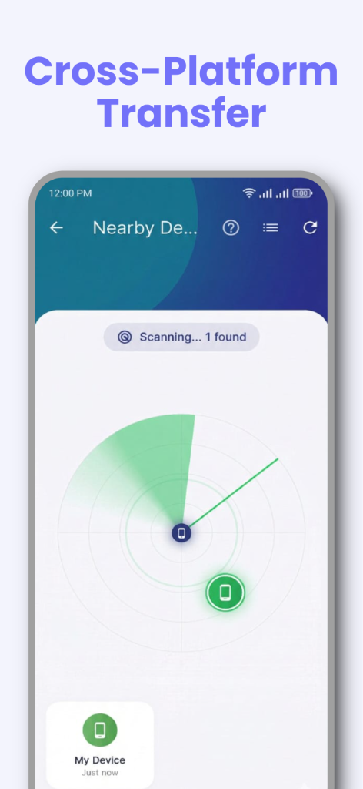
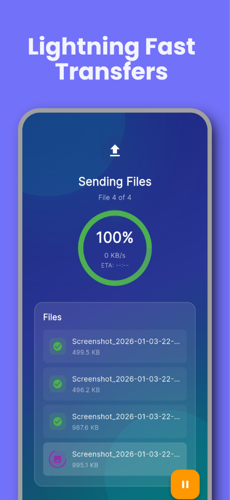
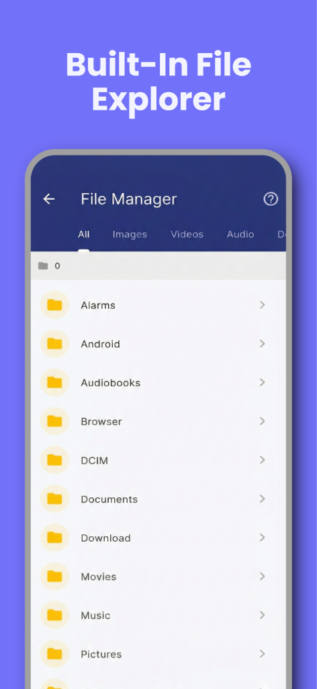
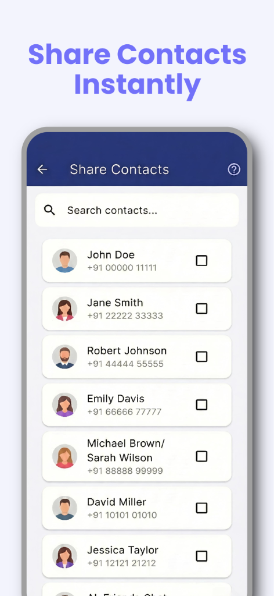
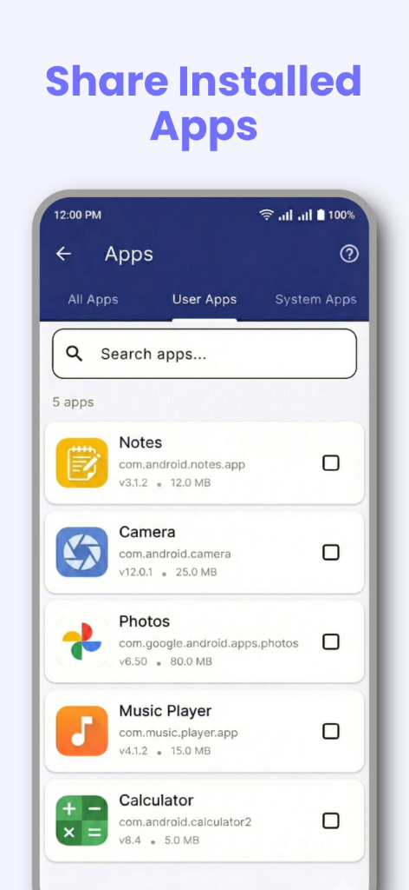
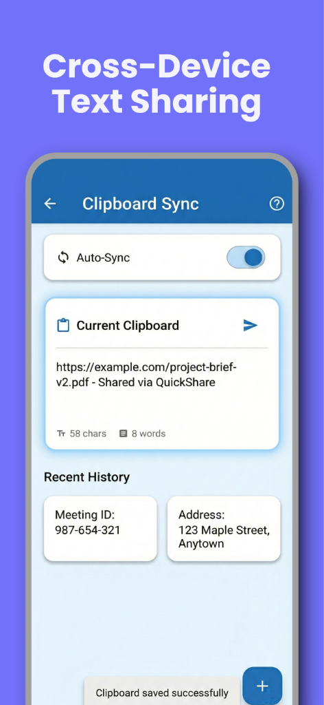

<p align="center">
  
</p>

<h1 align="center">NearTransfer</h1>

<p align="center">
  <strong>High-Performance Cross-Platform File Sharing</strong>
</p>

<p align="center">
  <a href="#features">Features</a> •
  <a href="#screenshots">Screenshots</a> •
  <a href="#architecture">Architecture</a> •
  <a href="#tech-stack">Tech Stack</a> •
  <a href="#performance">Performance</a> •
  <a href="#installation">Installation</a> •
  <a href="#license">License</a>
</p>

<p align="center">
  
  
  
  
</p>

<p align="center">
  
  
</p>

---

## 📋 Overview

**NearTransfer** is a production-ready, high-performance file sharing application built with Flutter. It enables lightning-fast peer-to-peer file transfers between Android and Windows devices over local WiFi networks — **no internet connection required**.

### The Problem

Traditional file sharing methods are frustratingly slow and inconvenient:
- **Bluetooth**: Limited to ~2-3 MB/s, pairing issues
- **Cloud Services**: Requires internet, uploads files to third-party servers
- **USB Cables**: Needs physical connection, driver compatibility issues
- **Email/Messaging**: File size limits, compression, privacy concerns

### The Solution

NearTransfer leverages **direct TCP socket connections** over local WiFi to achieve:
- ⚡ Transfer speeds up to **50x faster than Bluetooth**
- 🔐 **Zero cloud upload** — files never leave your network
- 📱 **Cross-platform** — Android ↔ Windows seamlessly
- 🚀 **Zero configuration** — auto-discovery of nearby devices

---

## ✨ Features

<table>
<tr>
<td width="50%">

### 📁 File Transfer
- Send any file type (photos, videos, documents, APKs)
- Batch transfer multiple files simultaneously
- Real-time progress with speed indicator
- Pause/Resume transfers

### 📱 App Sharing
- Share installed apps as APK files
- Browse user and system apps
- Quick search functionality

### 📂 File Manager
- Built-in file explorer
- Category filters (Images, Videos, Audio, Docs)
- Multi-select for quick sharing

</td>
<td width="50%">

### 📋 Clipboard Sync
- Copy text on one device, paste on another
- Instant cross-device clipboard sharing

### 👥 Contact Sharing
- Export/Import contacts via VCF format
- Bulk contact transfer support

### 🔧 Additional Tools
- **Shake Connect**: Shake both devices to connect instantly
- **Speed Test**: Measure WiFi transfer speeds
- **Transfer History**: Track all received files

</td>
</tr>
</table>

---

## 📸 Screenshots

<p align="center">
  
  
  
  
</p>

<p align="center">
  
  
  
</p>

---

## 🏗️ Architecture

The application follows **Clean Architecture** principles with a feature-first modular structure:

```
lib/
├── config/                    # App configuration
│   ├── routes.dart           # GoRouter navigation setup
│   └── theme.dart            # Material Design theming
│
├── core/                      # Core utilities
│   ├── constants.dart        # App-wide constants
│   ├── network_config.dart   # Network configuration
│   ├── ad_config.dart        # AdMob configuration
│   └── platform_utils.dart   # Platform detection utilities
│
├── features/                  # Feature modules
│   ├── home/                 # Home screen
│   ├── send/                 # File sending flow
│   ├── receive/              # File receiving flow
│   ├── transfer/             # Transfer progress UI
│   ├── file_manager/         # Built-in file explorer
│   ├── app_sharing/          # APK sharing
│   ├── contact_sharing/      # Contact export/import
│   ├── clipboard_sync/       # Cross-device clipboard
│   ├── shake_connect/        # Shake-to-connect feature
│   ├── speed_test/           # Network speed testing
│   ├── history/              # Transfer history
│   ├── settings/             # App settings
│   └── ...                   # Additional features
│
├── shared/                    # Shared components
│   ├── models/               # Data models
│   ├── services/             # Core services
│   │   ├── tcp_transfer_service.dart      # Direct TCP file transfer
│   │   ├── webrtc_service.dart            # WebRTC P2P fallback
│   │   ├── discovery_service.dart         # UDP device discovery
│   │   ├── signaling_socket_service.dart  # Connection signaling
│   │   ├── database_service.dart          # SQLite persistence
│   │   └── ...
│   ├── providers/            # State management (Provider)
│   ├── widgets/              # Reusable UI components
│   └── utils/                # Helper utilities
│
└── main.dart                 # Application entry point
```

### Key Engineering Decisions

| Decision | Rationale |
|----------|-----------|
| **TCP Sockets over WebRTC** | Direct TCP provides lower latency and higher throughput for local transfers. WebRTC used as fallback. |
| **UDP Discovery + TCP Probing** | UDP broadcast for fast discovery, TCP verification ensures connection reliability |
| **Streaming to Disk** | Files written directly to disk during transfer to prevent memory overflow with large files |
| **Isolate-based Processing** | Heavy file operations run in separate isolates to maintain 60fps UI |
| **SQLite for History** | Efficient local storage for transfer history with FFI support for desktop |

---

## 🛠️ Tech Stack

<table>
<tr>
<td>

### Framework & Language
- **Flutter** 3.9.2
- **Dart** 3.0+

### State Management
- **Provider** 6.x

### Networking
- **flutter_webrtc** — WebRTC P2P connections
- **dart:io** — Raw TCP/UDP sockets

### Storage
- **sqflite** — Mobile SQLite
- **sqflite_common_ffi** — Desktop SQLite
- **shared_preferences** — Key-value storage

</td>
<td>

### UI/UX
- **google_fonts** — Typography
- **animate_do** — Animations
- **glassmorphism** — Modern UI effects
- **qr_flutter** — QR code generation
- **mobile_scanner** — QR code scanning

### Platform Features
- **file_picker** — Native file selection
- **path_provider** — System directories
- **permission_handler** — Runtime permissions
- **flutter_local_notifications** — Notifications
- **wakelock_plus** — Keep screen awake
- **sensors_plus** — Shake detection

### Monetization
- **google_mobile_ads** — AdMob integration
- **in_app_purchase** — Premium features

</td>
</tr>
</table>

---

## 📊 Performance

### Benchmarks

| Metric | Value | Conditions |
|--------|-------|------------|
| **Transfer Speed** | 10-50 MB/s | Local WiFi, 5GHz recommended |
| **Connection Time** | < 3 seconds | Same network, low congestion |
| **1GB Video Transfer** | ~30 seconds | Optimal conditions |
| **100 Photos** | < 10 seconds | Average 3MB per photo |
| **Memory Usage** | Constant | Streaming prevents OOM |
| **UI Framerate** | 60 FPS | Isolate-based processing |

### Optimizations Implemented

- ✅ **Buffered streaming** — 64KB chunks for optimal throughput
- ✅ **Isolate processing** — Heavy operations off main thread
- ✅ **Connection pooling** — Reuse TCP connections for batch transfers
- ✅ **Adaptive chunk sizing** — Adjusts based on network conditions
- ✅ **Lazy loading** — On-demand resource initialization
- ✅ **Memoized widgets** — Prevent unnecessary rebuilds

---

## 🚀 Installation

### Prerequisites

- Flutter SDK 3.9.2+
- Android Studio / VS Code
- Android SDK 21+ (for Android builds)
- Windows 10+ (for Windows builds)

### Setup

```bash
# Clone the repository
git clone https://github.com/Nishanth619/neartransfer_flutter.git
cd neartransfer_flutter

# Install dependencies
flutter pub get

# Run on connected device
flutter run

# Build release APK
flutter build apk --release

# Build Windows executable
flutter build windows --release
```

---

## 📱 Download

<p align="center">
  
</p>

> 🧪 **Currently in Closed Testing** — Public release coming soon!

---

## 🔒 Privacy & Security

- **No Cloud Storage** — Files transfer directly between devices
- **No Internet Required** — Works completely offline on local WiFi
- **No Account Needed** — Start sharing immediately
- **No File Size Limits** — Send large files without compression
- **Local Network Only** — Data never leaves your WiFi network

---

## 📄 License

This project is **proprietary software**. All rights reserved.

© 2026 Nishanth Aradhya

---

## 👨‍💻 Author

<p align="center">
  
</p>

<p align="center">
  <strong>Nishanth Aradhya</strong>
</p>

<p align="center">
  <a href="https://github.com/Nishanth619">
    
  </a>
  <a href="mailto:aradhyanishanth84@gmail.com">
    
  </a>
</p>

---

<p align="center">
  Built with ❤️ using Flutter
</p>
